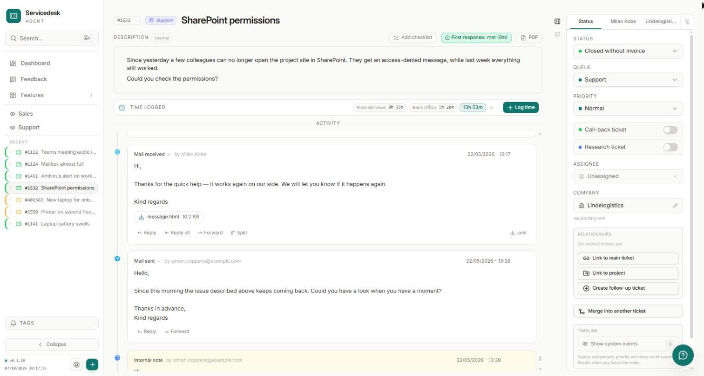
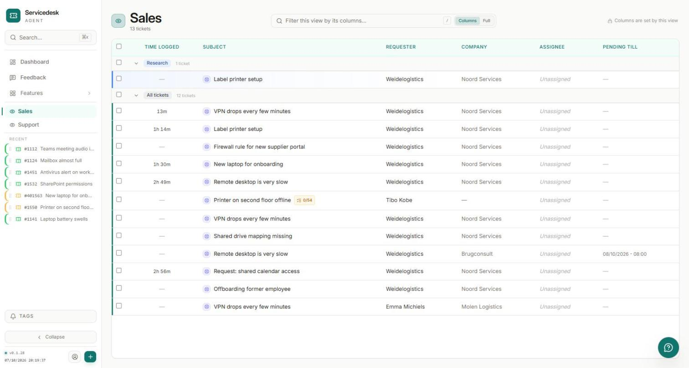
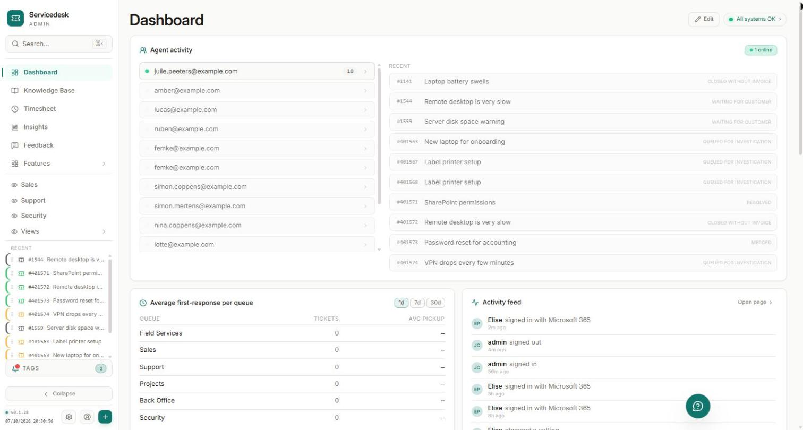
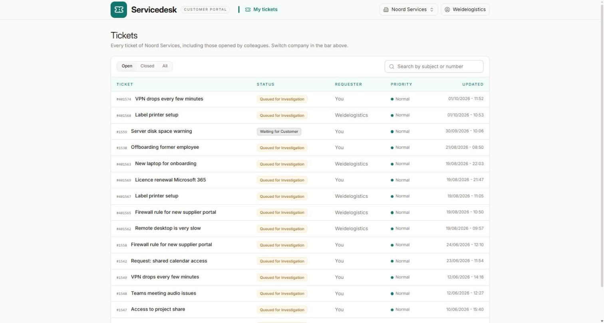
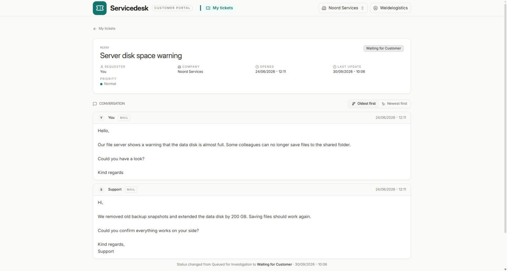
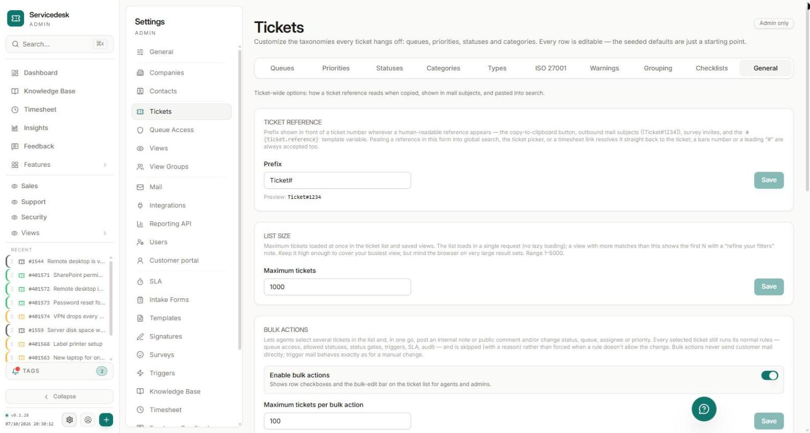
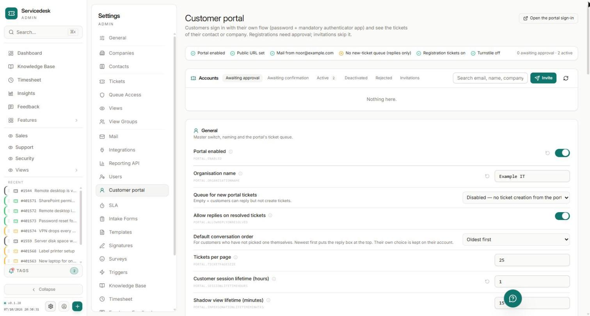
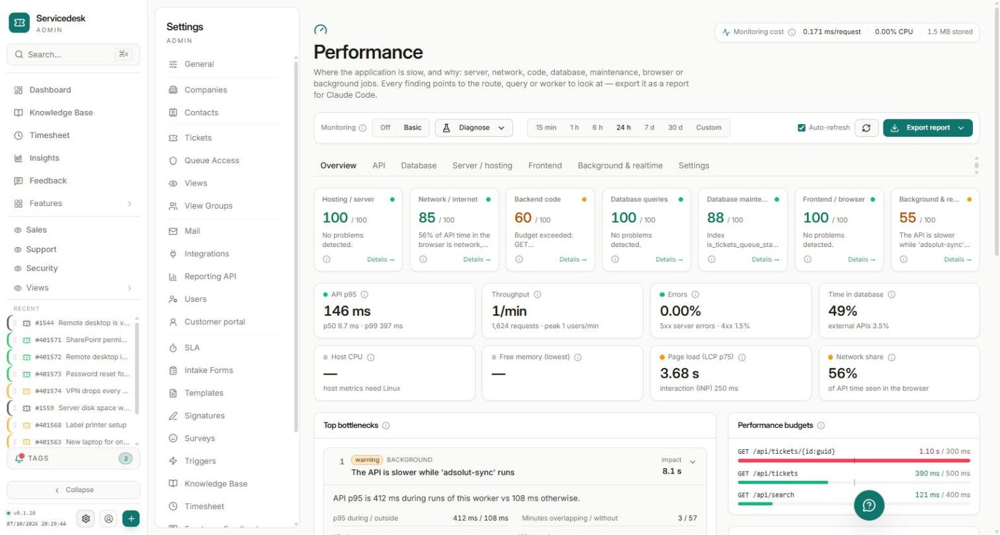

# Servicedesk

A self-hosted helpdesk for IT service teams. One install per organisation, on a single Ubuntu host, with Microsoft 365 mail built in. Tickets, mail, attachments and the audit trail stay on your own server.



<p align="center">
  
  
</p>

## Features

**Tickets and mail**
- Mail to your support mailbox becomes a ticket; replies thread back onto it, in both directions.
- Note, Mail and Call buttons on every ticket — internal notes, outgoing mail and logged phone calls, each with its own templates.
- Checklists per ticket (from admin templates) that can block closing until the required steps are done.
- Project tickets that group related tickets, with their logged time rolled up.
- Triggers, SLA targets, call-back and research flags, merge and split, and bulk actions on many tickets at once.

**Finding things**
- Saved views with their own filters, grouping, column layout and an optional search box.
- Global search (Ctrl/Cmd+K) across tickets, contacts, companies, knowledge base and settings — always limited to what the user may see.

**For your customers**
- A customer portal where contacts follow their tickets, reply and open new requests. Sign-in requires an authenticator app; new registrations are approved by your team.

**For your team**
- Time tracking on tickets, with a monthly overview and export.
- A knowledge base, dashboards and Insights reports.
- Live updates: see who is working on a ticket, and lists refresh by themselves.

**Integrations** (each optional and off by default)
- Microsoft 365 — mail (Microsoft Graph) and single sign-on for staff.
- Accounting sync (Wolters Kluwer Adsolut), Telavox call pop-ups, Tactical RMM assets, and a one-time import from Zammad.

**Administration**
- Everything tunable lives on a searchable Settings page — no config files to edit.
- A health page, a tamper-evident audit log, and a performance page that shows where time is spent.
- Two themes per user: *Steaan* (flat and light, the default) and *Nebula* (light or dark).

## Screenshots

**Customer portal** — customers see the tickets of their company and follow the conversation.

<p align="center">
  
  
</p>

**Settings** — every option lives on one searchable Settings page, each with a short explanation.

<p align="center">
  
  
</p>

**Performance** — shows where time is spent, from the server to the browser.



*All screenshots use anonymised demo data.*

## Built with

ASP.NET Core 8 (C#) · PostgreSQL · React 19 + TypeScript · Tailwind CSS · SignalR · Docker Compose + Nginx

## Requirements

- **Ubuntu 24.04 LTS** (`x86_64`), with root or passwordless `sudo`.
- A public DNS record pointing at the host, with ports `80` and `443` open (for Let's Encrypt).
- Optional: a Microsoft 365 tenant for mail and sign-in — can be set up after installation.

## Install

One command on a fresh host:

```bash
bash <(curl -sSL https://raw.githubusercontent.com/404-developer-AI/servicedesk/main/deploy/install.sh)
```

The installer asks for the domain, an admin email and a few database details, then sets up Docker, PostgreSQL (on the host), the app with Nginx, and TLS certificates. It can be re-run safely. At the end it prints a one-time link to create the first admin account.

The host firewall and SSH configuration are left untouched — open `80` and `443` (and `22` for yourself) on whatever firewall you use.

More detail: [deployment runbook](docs/deployment-runbook.md) · [Microsoft Graph setup](docs/microsoft-graph-setup.md)

## Update

```bash
bash <(curl -sSL https://raw.githubusercontent.com/404-developer-AI/servicedesk/main/deploy/update.sh)
```

Offers a backup first and rolls back automatically if the new version does not start cleanly. Users who have the app open are moved to the new version on their own, without losing their session.

## Backup and restore

```bash
sudo /opt/servicedesk/deploy/backup.sh
sudo /opt/servicedesk/deploy/restore.sh /var/backups/servicedesk/<timestamp>
```

A backup holds the database and the stored files together, so a restore is always consistent. See the [backup runbook](docs/backup-runbook.md).

## Local development

No Docker needed: PostgreSQL runs natively, the API on Kestrel and the frontend on Vite.

```bash
# 1. Create a PostgreSQL database and role; the schema is created on first run.

# 2. Development secrets (user-secrets, not .env):
dotnet user-secrets --project src/Servicedesk.Api set "ConnectionStrings:Postgres" "Host=localhost;Database=servicedesk_dev;Username=sd_dev;Password=..."
dotnet user-secrets --project src/Servicedesk.Api set "Audit:HashKey"            "$(openssl rand -base64 32)"
dotnet user-secrets --project src/Servicedesk.Api set "DataProtection:MasterKey" "$(openssl rand -base64 32)"

# 3. API on :5080
dotnet run --project src/Servicedesk.Api

# 4. Frontend on :5173 (proxies /api and /hubs to the API)
cd src/Servicedesk.Web
npm install
npm run dev
```

## Security

- Parameterised SQL only; input validated at every boundary.
- Argon2id passwords, TOTP two-factor authentication, Microsoft 365 sign-in for staff.
- HTTPS with HSTS, Content-Security-Policy, CSRF protection and rate limiting.
- Secrets and sensitive fields encrypted at rest.
- Append-only, hash-chained audit log.
- Suspicious addresses (vulnerability-scanner probes, abuse bursts) are raised for an admin to block or whitelist; obvious scanners are blocked temporarily straight away.

To report a vulnerability, see [SECURITY.md](SECURITY.md).

## License

Apache License 2.0 — see [LICENSE](LICENSE). Provided as is, without warranty of any kind.
